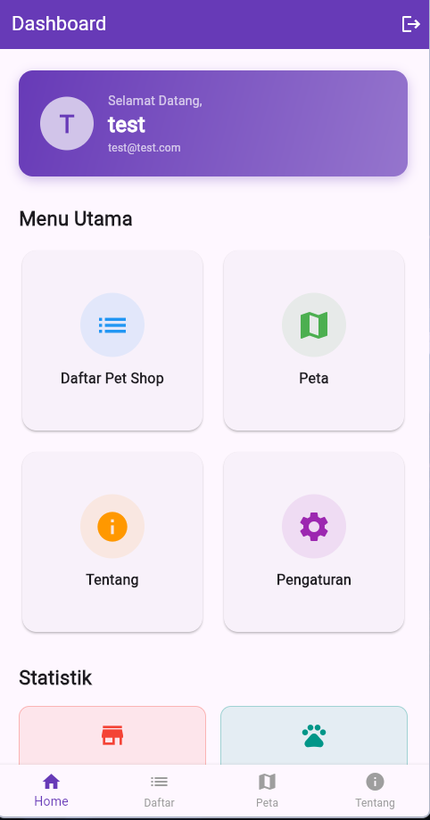
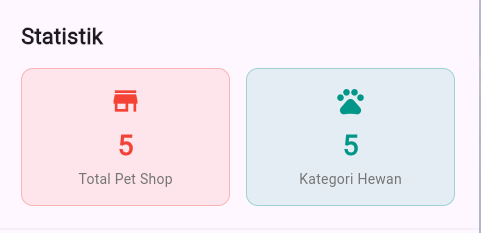
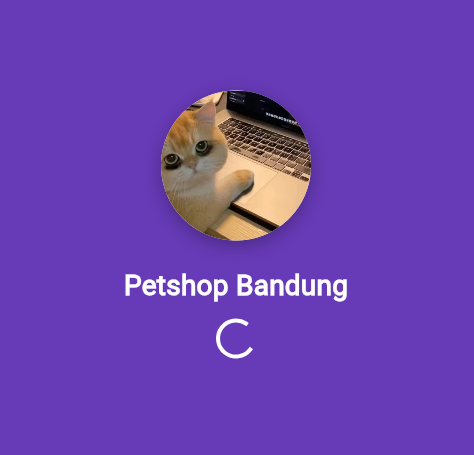
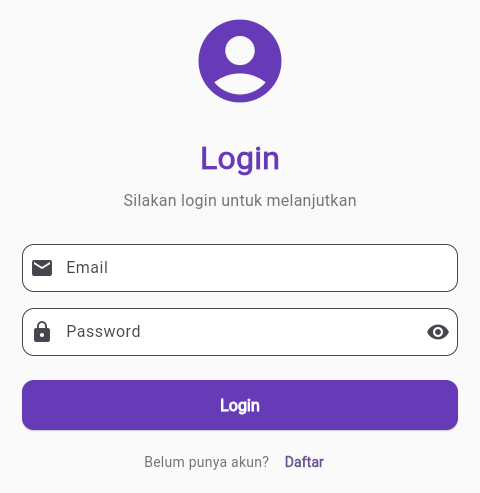
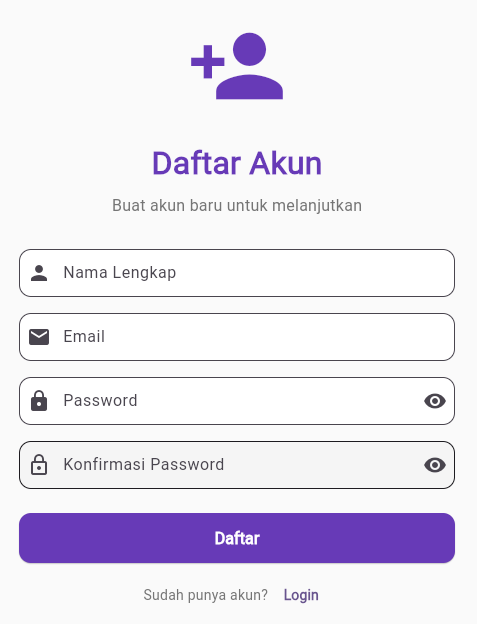
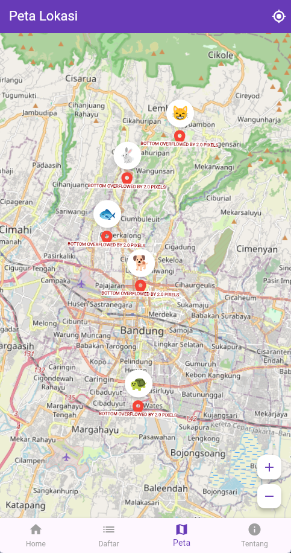
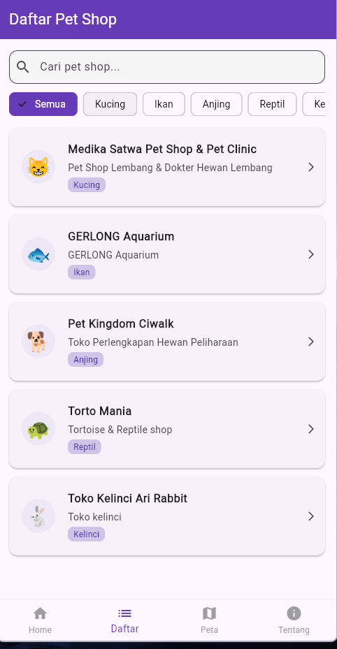
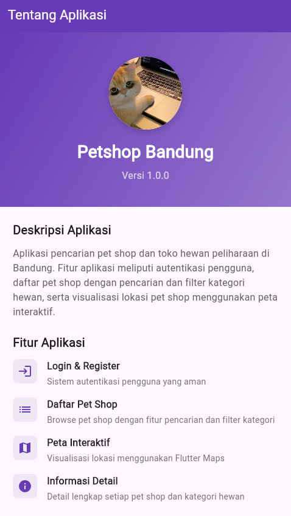
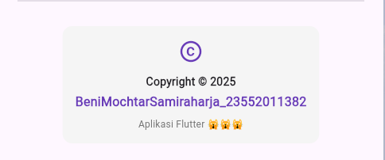

# UTS Pemrograman Mobile 2
## Aplikasi Petshop Bandung Dengan Flutter

## Pendahuluan

Aplikasi Pencari Petshop Bandung adalah sebuah aplikasi mobile berbasis Flutter yang dirancang untuk memudahkan pengguna dalam menemukan petshop terdekat di kota Bandung dengan fitur-fitur lengkap. Aplikasi ini mengintegrasikan teknologi Flutter Maps untuk menampilkan lokasi petshop secara real-time, dilengkapi dengan sistem otentikasi yang aman melalui halaman login dan register, serta navigasi intuitif menggunakan sidebar, bottom navigation, atau navigation bar untuk memaksimalkan pengalaman pengguna. Dengan menampilkan informasi petshop dalam format list atau grid view, aplikasi ini memberikan solusi praktis bagi pecinta hewan peliharaan untuk mengakses data petshop lengkap dengan detail lokasi, kontak, dan layanan yang tersedia di setiap tempat.

## Komponen Aplikasi

### z. Homepage
**File:** `lib/screens/home_screen.dart`

- Beberapa tombol navigasi ke halaman
  - Daftar Pet Shop
  - Peta
  - Tentang
  - Pengaturan (hanya sebagai contoh)
- Statistik
  - Total Pet Shop
  - Kategori Hewan

### a. SplashScreen
**File:** `lib/screens/splash_screen.dart`

Implementasi splash screen:
- Durasi tampil 3 detik
- Menampilkan logo aplikasi (gambar pet shop)
- Loading indicator
- Auto-check status login menggunakan SharedPreferences
- Navigasi otomatis ke Login atau Home berdasarkan status login pengguna

### b. Halaman Login
**File:** `lib/screens/login_screen.dart`

Fitur login:
- Form input email dan password dengan validasi
- Penyimpanan status login dengan SharedPreferences
- Tombol navigasi ke halaman Register
- Auto-navigate ke Home setelah login berhasil
- Dialog peringatan untuk kredensial yang salah

### c. Halaman Register
**File:** `lib/screens/register_screen.dart`

Fitur register meliputi:
- Form input: Nama, Email, Password, Konfirmasi Password
- Validasi input (format email, kecocokan password)
- Penyimpanan data pengguna dengan SharedPreferences
- Auto-login dan redirect ke Home setelah registrasi berhasil
- Tombol navigasi kembali ke Login

### d. Library Flutter Maps
**Dependencies:** `pubspec.yaml`

Library yang digunakan:
- `flutter_map: ^7.0.2`
- `latlong2: ^0.9.1`

**Implementasi:** `lib/screens/map_screen.dart`
- Peta interaktif menggunakan OpenStreetMap
- 5 marker lokasi pet shop di Bandung
- Popup informasi detail saat marker diklik
- Zoom controls untuk navigasi peta
- Koordinat geografis akurat untuk setiap lokasi

### e. Halaman List Informasi
**File:** `lib/screens/list_screen.dart`

Fitur ListView:
- Menampilkan 5 pet shop di Bandung
- Card layout dengan informasi:
  - Nama pet shop
  - Deskripsi
  - Kategori hewan yang tersedia (chips)
- Fitur Pencarian: Search bar untuk mencari pet shop berdasarkan nama atau alamat
- Fitur Filter: Filter berdasarkan kategori hewan:
  - Semua
  - Kucing
  - Anjing
  - Burung
  - Kelinci

### f. Menu Navigation
**File:** `lib/screens/home_screen.dart`

Menggunakan Bottom Navigation Bar dengan 4 menu utama:

1. **Home (Dashboard)**
   - Welcome card dengan informasi pengguna
   - Grid menu untuk navigasi cepat
   - Statistik aplikasi

2. **Daftar (List Screen)**
   - Daftar lengkap pet shop
   - Fitur search dan filter

3. **Peta (Map Screen)**
   - Visualisasi lokasi pada peta interaktif

4. **Tentang (About Screen)**
   - Informasi aplikasi dan copyright

Fitur tambahan:
- Logout button di AppBar
- Dialog konfirmasi sebelum logout
- State management untuk navigation

### g. About Aplikasi
**File:** `lib/screens/about_screen.dart`

### h. Halaman About berisi:
- Logo aplikasi
- Nama aplikasi: Petshop Bandung
- Versi: 1.0.0
- Deskripsi lengkap aplikasi
- Daftar fitur aplikasi dengan icon
- Informasi Copyright:
  - Copyright © 2025
  - BeniMochtarSamiraharja_23552011382
  - Aplikasi Flutter

## i. Teknologi yang Digunakan:

### Dependencies (pubspec.yaml)
- `flutter` - Framework utama untuk pengembangan aplikasi
- `cupertino_icons: ^1.0.8` - Icon iOS style
- `flutter_map: ^7.0.2` - Library untuk peta interaktif
- `latlong2: ^0.9.1` - Library untuk koordinat geografis
- `shared_preferences: ^2.3.3` - Local storage untuk data pengguna

### Assets
- Logo aplikasi: `assets/images/haan!_.jpeg`
